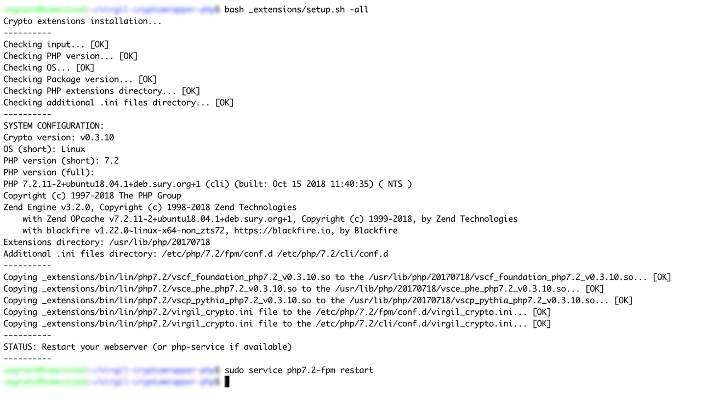
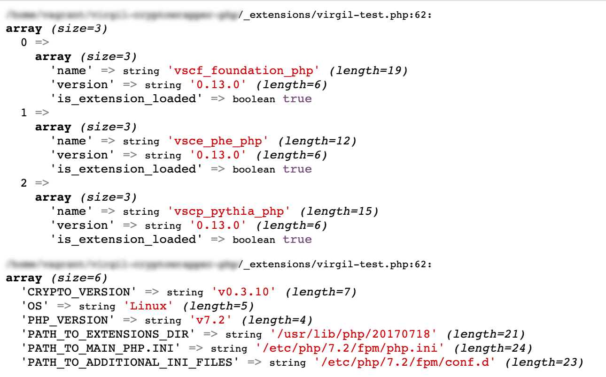

# Virgil Security PHP Crypto Library Wrapper

[](https://travis-ci.com/VirgilSecurity/virgil-cryptowrapper-php)
[](https://github.com/VirgilSecurity/virgil/blob/master/LICENSE)

### [Introduction](#introduction) | [Features](#features) | [Installation](#installation) | [Docs](#docs) | [License](#license) | [Contacts](#support)

## Introduction
This library is designed to be a small, flexible and convenient wrapper for a variety of crypto algorithms. So it can be used in a small microcontroller as well as in a high load server application. Also, it provides a bunch of custom hybrid algorithms that combine different crypto algorithms to solve common complex cryptographic problems in an easy way. That eliminates requirement for developers to have a strong cryptographic skills.

Virgil Security PHP Crypto Library Wrapper is a wrapper for [Virgil Security Crypto Library](https://github.com/VirgilSecurity/virgil-crypto-c).

## Features
Virgil Security Crypto library wrapper is decomposed to small libraries with specific purposes, so a developer can freely choose a subset of them.

### Library: Foundation

This library contains basic cryptographic algorithms and can be used as building blocks for complex solutions.

| Algorithm Purpose           | Implementation details                                                                                                                                    |
|-----------------------------|-----------------------------------------------------------------------------------------------------------------------------------------------------------|
| Key Generation, PRNG        | CTR_DRBG [NIST SP 800-90A](http://nvlpubs.nist.gov/nistpubs/SpecialPublications/NIST.SP.800-90Ar1.pdf)                                                    |
| Key Derivation              | [KDF1, KDF2](https://www.shoup.net/iso/std6.pdf),  [HKDF](https://tools.ietf.org/html/rfc5869), [PBKDF2](https://tools.ietf.org/html/rfc8018#section-5.2) |
| Key Exchange                | [X25519](https://tools.ietf.org/html/rfc7748), [RSA](http://nvlpubs.nist.gov/nistpubs/SpecialPublications/NIST.SP.800-56Br1.pdf)                          |
| Hashing                     | [SHA-2 (224/256/384/512)](https://tools.ietf.org/html/rfc4634)                                                                                            |
| Message Authentication Code | [HMAC](https://www.ietf.org/rfc/rfc2104.txt)                                                                                                              |
| Digital Signature           | [Ed25519](https://tools.ietf.org/html/rfc8032), [RSASSA-PSS](https://tools.ietf.org/html/rfc4056)                                                         |
| Entropy Source              | Linux, macOS [/dev/urandom](https://tls.mbed.org/module-level-design-rng),<br>Windows [CryptGenRandom()](https://tls.mbed.org/module-level-design-rng)    |
| Symmetric Algorithms        | [AES-256-GCM](http://nvlpubs.nist.gov/nistpubs/Legacy/SP/nistspecialpublication800-38d.pdf), [AES-256-CBC](https://tools.ietf.org/html/rfc3602)           |
| Encryption schemes          | [PBES2](https://tools.ietf.org/html/rfc8018#section-6.2)                                                                                                  |
| Elliptic Curves             | [Ed25519](https://tools.ietf.org/html/rfc8032), [Curve25519](https://tools.ietf.org/html/rfc7748)                                                         |

### Library: PHE

Cryptographic background for the [Password-Hardened Encryption (PHE) protocol](https://virgilsecurity.com/wp-content/uploads/2018/11/PHE-Whitepaper-2018.pdf) that provides developers with a technology to protect users 
passwords from offline attacks and make stolen passwords useless even if your database has been compromised.

### Library: Pythia

Implementation of the [Pythia](http://pages.cs.wisc.edu/~ace/papers/pythia-full.pdf) protocol.

## Installation

This package is available for PHP versions **7.2**, **7.3** and **7.4**.

- **Step #1.** Install the crypto wrapper with the following code:

    ```bash
    composer require virgil/crypto-wrapper
    ```

- **Step #2.** Add the crypto extensions into your server with the following code and follow the instructions below:
     ```bash
     sh vendor/virgil/crypto-wrapper/_extensions/setup.sh -all
     ```
     
## Additional information

### Manual adding the crypto extension into your server

- Execute on your server [virgil-test.php](_extensions/virgil-test.php) file.

- Copy [extensions](_extensions/bin) files according to your server operating system and PHP version to the extensions directory.
    - For Linux/Darwin:
    ```
     $ path="{PASTE_PATH_TO_EXTENSIONS_DIR_HERE}"
     $ cp {PASTE_EXTENSION_NAME_HERE} $path
    ```
    - For Windows:
    ```
     $ set path={PASTE_PATH_TO_EXTENSIONS_DIR_HERE}
     $ copy {PASTE_EXTENSION_NAME_HERE} %path%
    ```
- Copy [virgil_crypto.ini](_extensions/bin) file according to your server operating system and PHP version to the PATH_TO_ADDITIONAL_INI_FILES:
    - For Linux/Darwin
    ```
    $ cp virgil_crypto.ini {PASTE_PATH_TO_ADDITIONAL_INI_FILE_HERE}
    ```
    - For Windows:
    ```
    $ copy virgil_crypto.ini {PASTE_PATH_TO_ADDITIONAL_INI_FILE_HERE}
    ```
    
- Restart your server or php-fpm service

#### Extensions installation example

Our web stack is: *Linux, nginx, php7.2-fpm*

- Execute [virgil-test.php](_extensions/virgil-test.php) to find your path to the extensions directory and the path to the additional ini files (or to the main php.ini file):
  

- Then, go to the command line interface (CLI) to specify the paths you've identified in the previous step and restart your server or php-fpm service:
  

- Reload the page in your browser to see that the extension is loaded:
  

## Docs
- [Crypto Core Library](https://github.com/VirgilSecurity/virgil-crypto-c)
- [More usage examples](https://developer.virgilsecurity.com/docs/how-to#cryptography)

## License

This library is released under the [3-clause BSD License](LICENSE).

## Support
Our developer support team is here to help you.

You can find us on [Twitter](https://twitter.com/VirgilSecurity) or send us email support@VirgilSecurity.com.

Also, get extra help from our support team on [Slack](https://virgilsecurity.com/join-community).
